# Clinical Trial Success Prediction for Pharmaceutical Decision Support

A healthcare / pharmaceutical analytics machine learning project predicting whether a
clinical trial is likely to reach operational completion, using only information
available at or near the trial's design stage.

**🔗 Live app:** [clinicaltrialsuccessprediction-yrvyzr9jt7dsaefrhmubja.streamlit.app](https://clinicaltrialsuccessprediction-yrvyzr9jt7dsaefrhmubja.streamlit.app)

## Project Overview

This project builds an end-to-end classical ML pipeline — from raw ClinicalTrials.gov
data through cleaning, feature engineering, model tuning, explainability, and business
recommendations — to support portfolio-risk decisions in pharmaceutical R&D and CRO
operations. It is designed to run entirely on Google Colab Free, using only classical
ML (no deep learning, no heavy NLP) to keep it accessible and fast to reproduce. A
Streamlit app puts the final model in front of a live, interactive form so a
non-technical stakeholder can score a hypothetical trial without touching the notebook.

## Project Highlights

- End-to-end pipeline: data cleaning → feature engineering → EDA → model tuning →
  explainability → business recommendations
- Four baseline models (Logistic Regression, Decision Tree, Random Forest, XGBoost)
  compared fairly under one shared preprocessing pipeline
- Hyperparameter tuning via `RandomizedSearchCV`, plus probability calibration and
  decision-threshold analysis
- Model selection driven by `PR-AUC (Failure=0)` and calibration quality — not raw
  accuracy — to properly account for class imbalance
- SHAP-based explainability with global and local explanations, cross-checked against
  earlier EDA hypotheses rather than taken at face value
- A validated three-tier business risk workflow (High / Medium / Low) for portfolio
  review prioritization
- A live Streamlit app that scores a single, user-described trial and explains the
  prediction with a local SHAP breakdown — not just static notebook screenshots
- Runs entirely on Google Colab Free — CPU only, no paid GPU required

## Project Pipeline

The project follows a structured, phase-by-phase pipeline from raw data to
business-ready insights.

<p align="center">
  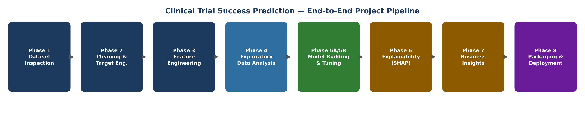
</p>
<p align="center"><em>End-to-end pipeline from dataset inspection through packaging and deployment.</em></p>

## Business Motivation

Clinical trials are the largest cost driver in pharmaceutical R&D, and a substantial
share of registered trials terminate before completion — for funding, recruitment, or
strategic reasons. Every trial that fails after resources are already committed
represents sunk cost, delayed patient benefit, and portfolio risk. This project
explores whether design-time trial characteristics carry enough signal to flag at-risk
trials early enough for portfolio and operations teams to act on.

## Dataset

Source: [ClinicalTrials.gov Clinical Trials Dataset (Kaggle)](https://www.kaggle.com/datasets/danielansted/clinicaltrials-gov-clinical-trials-dataset)

The target (`trial_success`) is an **operational** definition — `Completed` = success;
`Terminated` / `Withdrawn` / `Suspended` = failure; unresolved and Expanded Access
Program statuses are excluded. This is explicitly *not* a clinical efficacy label — see
the notebook's Assumptions & Limitations section for the full reasoning.

### Dataset Inspection

A first look at the raw data — structure, target class balance, and data quality —
before any cleaning or modeling decisions were made.

<p align="center">
  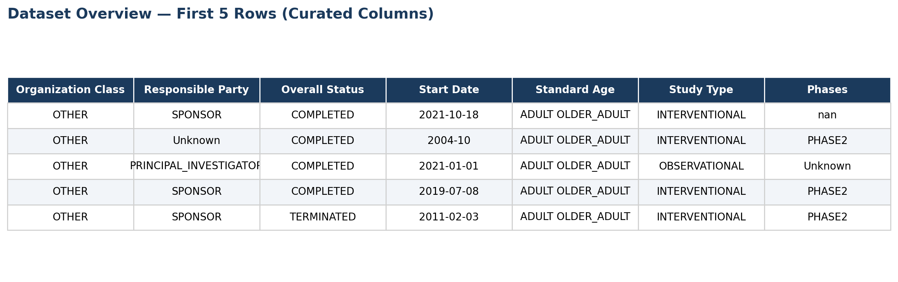
</p>
<p align="center"><em>Curated preview of the raw dataset's structure and key columns.</em></p>

<p align="center">
  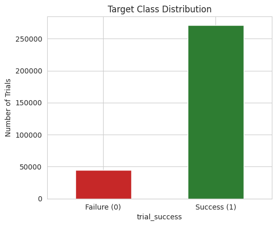
</p>
<p align="center"><em>Class distribution of the engineered target, trial_success.</em></p>

<p align="center">
  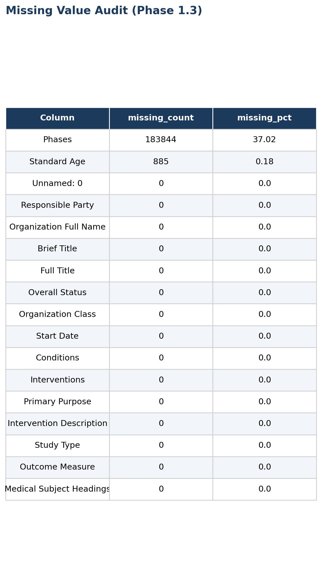
</p>
<p align="center"><em>Missing value audit used to guide the Phase 2 cleaning strategy.</em></p>

## Methodology

1. **Dataset Inspection** — schema verified programmatically rather than assumed
2. **Data Cleaning & Target Engineering** — case-normalized status mapping, leakage
   audit, duplicate handling
3. **Feature Engineering** — 13 features built strictly from what the data supports
   (condition/intervention counts, eligibility flags, sponsor type, complexity index)
4. **Exploratory Data Analysis** — business-question-driven, hypothesis-testing EDA
5. **Model Building** — Logistic Regression, Decision Tree, Random Forest, XGBoost
   compared under one shared preprocessing pipeline
6. **Hyperparameter Tuning & Validation** — `RandomizedSearchCV`, calibration analysis,
   decision threshold analysis
7. **Explainability** — SHAP global and local explanations, translated into business
   language and checked against domain hypotheses
8. **Business Insights** — a validated risk-tiering workflow and stakeholder-specific
   recommendations
9. **Deployment** — an interactive Streamlit app wrapping the saved pipeline for
   live, single-trial scoring

### Feature Engineering

Thirteen features were engineered directly from the available dataset — no fabricated
or unsupported fields — each with a stated business rationale.

<p align="center">
  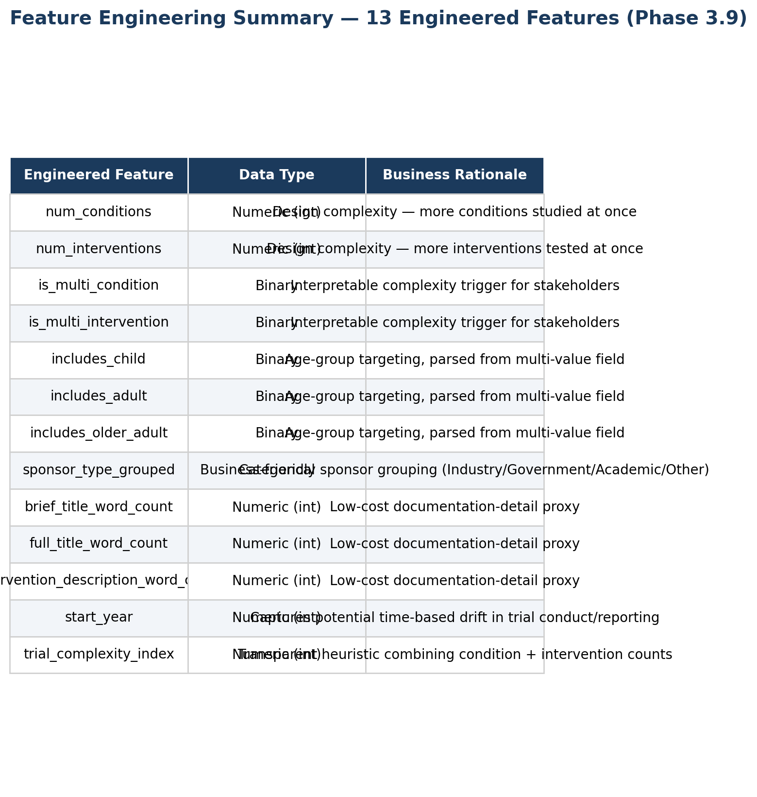
</p>
<p align="center"><em>Summary of engineered features, data types, and business rationale.</em></p>

## Key Results

See the notebook's Phase 5A/5B comparison tables for full metrics. Model selection was
based on `PR-AUC (Failure=0)` and calibration quality — not raw accuracy — since
accuracy is dominated by the ~86% majority (success) class in this dataset.

### Model Development

Four baseline models were compared under one shared preprocessing pipeline, and the
top two candidates were tuned, calibrated, and evaluated on held-out test data.

<p align="center">
  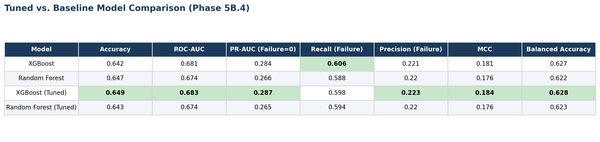
</p>
<p align="center"><em>Tuned vs. baseline model comparison across accuracy, ranking, and failure-detection metrics.</em></p>

<p align="center">
  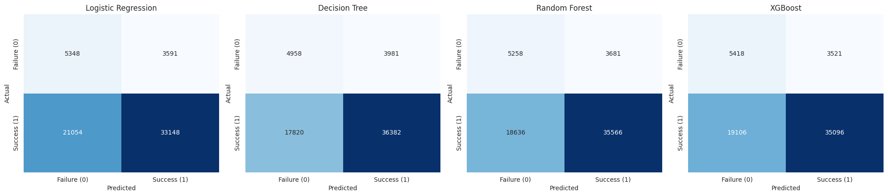
</p>
<p align="center"><em>Confusion matrices for all baseline models on the held-out test set.</em></p>

<p align="center">
  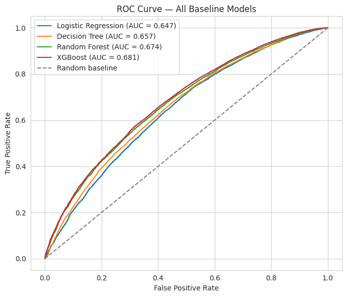
</p>
<p align="center"><em>ROC curves comparing discriminative performance across models.</em></p>

<p align="center">
  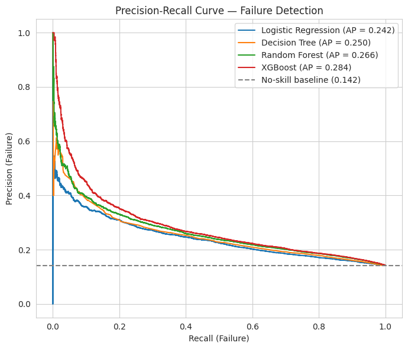
</p>
<p align="center"><em>Precision-recall curves framed around failure detection, the minority class.</em></p>

<p align="center">
  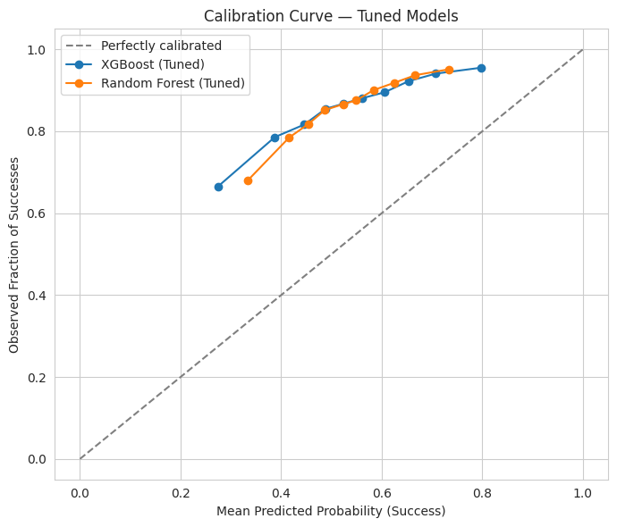
</p>
<p align="center"><em>Calibration curves assessing whether predicted probabilities reflect real-world likelihoods.</em></p>

## Explainability (SHAP)

SHAP (`TreeExplainer`) was used to identify the design-time features most associated
with predicted success/failure, with global summary/dependence plots and three local
explanations (high-confidence success, high-confidence failure risk, and a borderline
case). Findings were explicitly checked against earlier EDA hypotheses, with any
contradictions documented rather than smoothed over. The same `TreeExplainer` logic
powers the live per-trial explanation in the Streamlit app below.

<p align="center">
  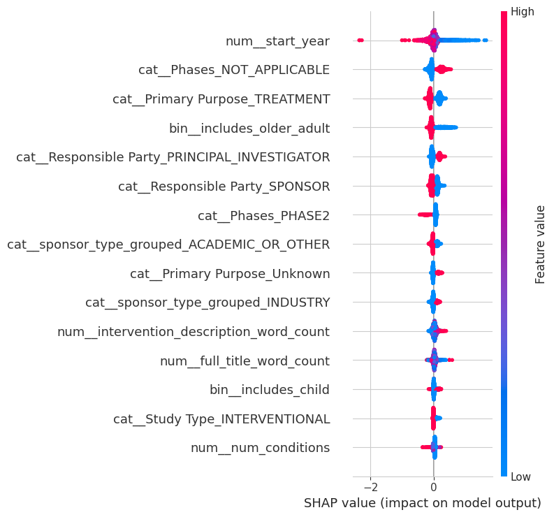
</p>
<p align="center"><em>Global SHAP summary plot showing feature impact direction and magnitude.</em></p>

<p align="center">
  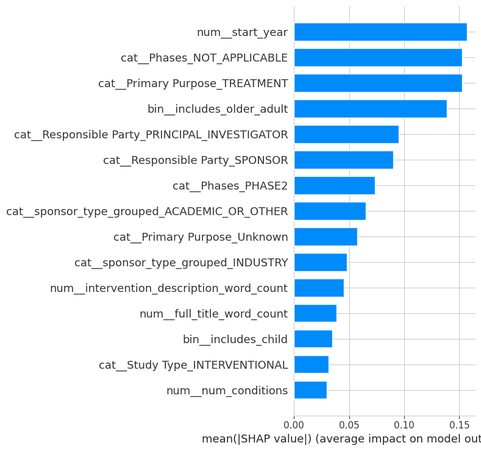
</p>
<p align="center"><em>Ranked feature importance by mean absolute SHAP value.</em></p>

<p align="center">
  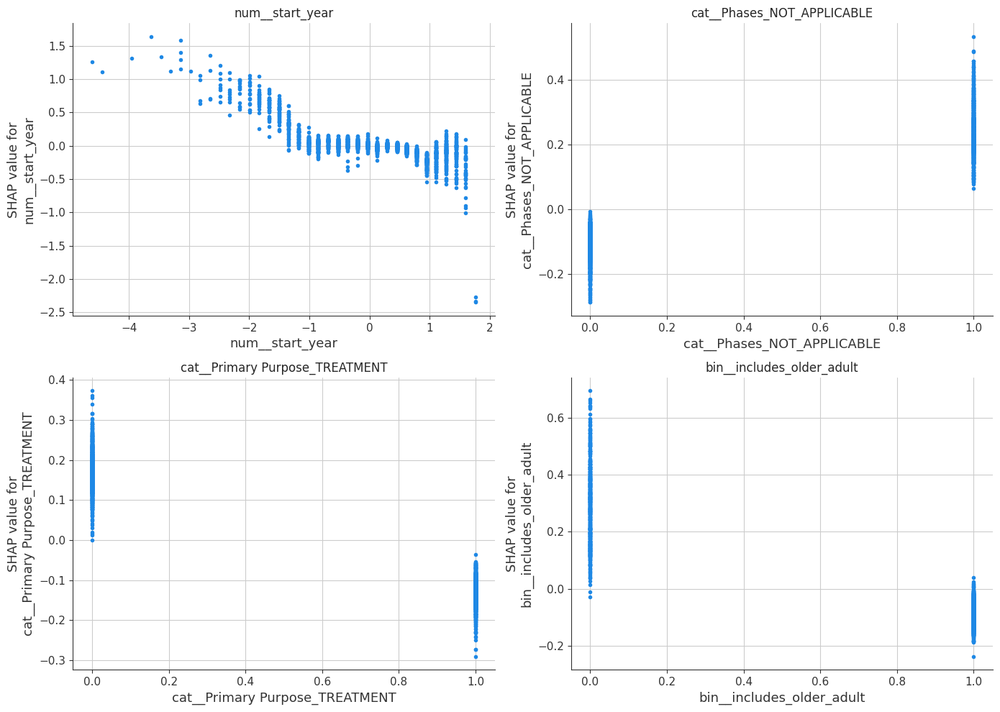
</p>
<p align="center"><em>Dependence plots for the most influential features.</em></p>

## Business Insights & Recommendations

A three-tier risk workflow (High / Medium / Low, based on predicted success
probability) is proposed for portfolio review prioritization, validated against actual
held-out completion rates. See the notebook's Phase 7 for the full stakeholder-specific
recommendations and an explicit statement of what this analysis does *not* claim
(no causality, no clinical efficacy claim, no measured financial ROI).

<p align="center">
  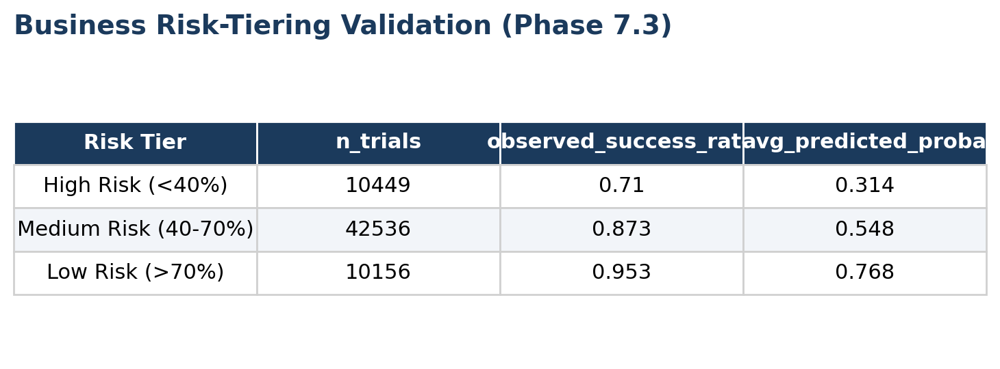
</p>
<p align="center"><em>Risk-tier validation showing observed completion rates align with predicted risk bands.</em></p>

Underlying EDA patterns that informed the engineered features and the business
narrative above:

<p align="center">
  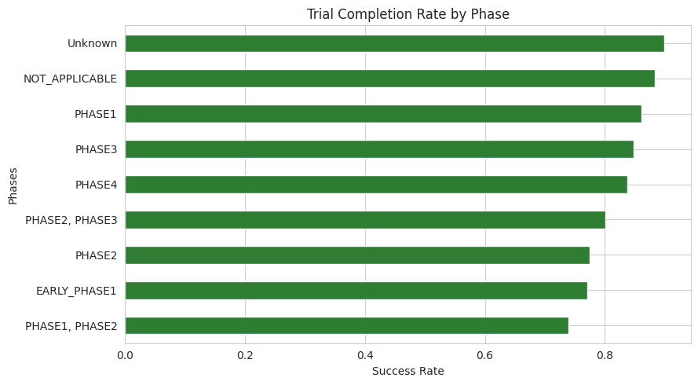
</p>
<p align="center"><em>Completion rate by clinical trial phase.</em></p>

<p align="center">
  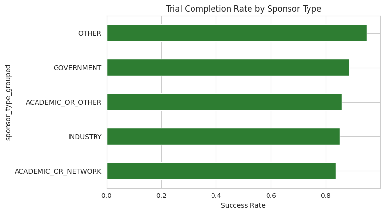
</p>
<p align="center"><em>Completion rate by sponsor type.</em></p>

<p align="center">
  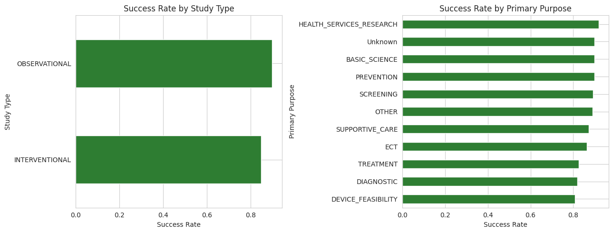
</p>
<p align="center"><em>Completion rate by study type and primary purpose.</em></p>

<p align="center">
  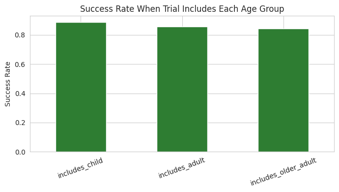
</p>
<p align="center"><em>Completion rate by age-group eligibility targeting.</em></p>

<p align="center">
  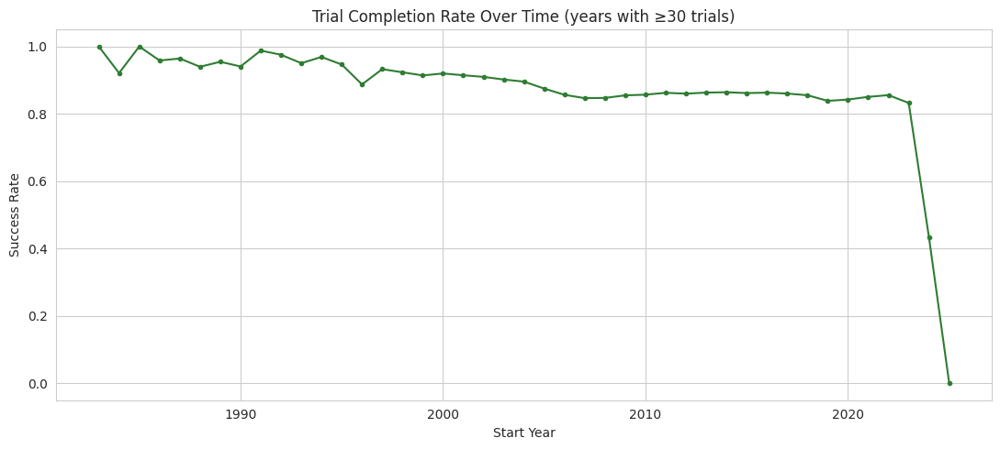
</p>
<p align="center"><em>Completion rate trend across trial start years.</em></p>

<p align="center">
  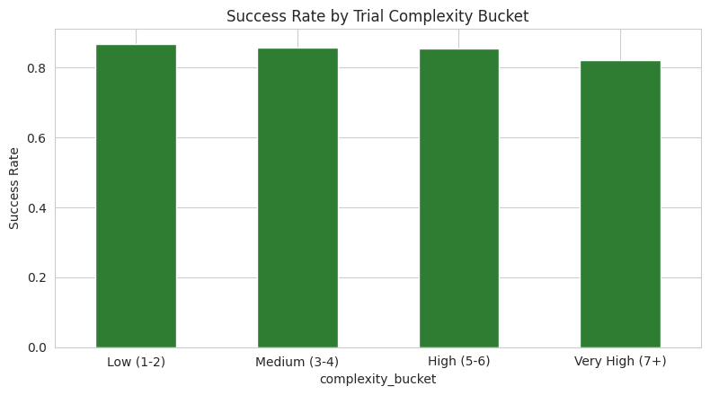
</p>
<p align="center"><em>Completion rate by trial complexity bucket.</em></p>

## Live Streamlit App

The saved pipeline (`models/final_model.pkl` — preprocessing + tuned classifier
bundled together) is wrapped in a single-page Streamlit app so anyone can score a
hypothetical trial without opening the notebook.

**🔗 [Try it live](https://clinicaltrialsuccessprediction-yrvyzr9jt7dsaefrhmubja.streamlit.app)**

<p align="center">
  
</p>
<p align="center"><em>Interactive predictor: sidebar inputs on the left, predicted success probability, risk tier, and a local SHAP explanation on the right.</em></p>

**What it does:**

- Takes trial details as input — title/description text, conditions and interventions,
  eligibility (age groups), sponsor organization class, responsible party, primary
  purpose, study type, phase, and planned start year
- Derives the same 17 engineered features the pipeline was trained on (word counts,
  multi-condition/intervention flags, complexity index, sponsor grouping) so the input
  row matches training-time preprocessing exactly
- Returns the predicted success probability, the same High/Medium/Low risk tier used
  in Phase 7.3 (cut at 40% / 70%), and a local SHAP bar chart showing which inputs
  pushed the prediction toward success (green) or failure (red) for that specific trial
- Displays a disclaimer banner consistent with the notebook's Assumptions &
  Limitations section — this is a portfolio demo reflecting statistical association in
  historical registry data, not a clinical, efficacy, or investment recommendation

**Note on this screenshot:** Streamlit apps are interactive, so a single static image
can only capture one input configuration and one moment in the sidebar's scroll
position — click the live link above to actually try different trial inputs.

## Technologies Used

- Python
- Pandas
- NumPy
- Scikit-learn
- XGBoost
- SHAP
- Matplotlib
- Seaborn
- Streamlit
- Google Colab (CPU only, no paid GPU required)

## Installation

```bash
pip install -r requirements.txt
```

## How to Run

**Notebook (model training):**

1. Open `notebooks/Clinical_Trial_Success_Prediction.ipynb` in Google Colab
2. Upload the dataset to Google Drive at:
   `/content/drive/MyDrive/Clinical_Trial_Success_Prediction/Data/clin_trials.csv`
3. Run all cells top to bottom — no manual edits required (see the Reproducibility
   Checklist in the notebook's Phase 8 for details). Phase 8.5 saves the fitted
   pipeline to `models/final_model.pkl`.

**Streamlit app (local):**

1. Make sure `models/final_model.pkl` exists (from the notebook run above)
2. From the project root, run:
   ```bash
   streamlit run app.py
   ```
3. Open the local URL Streamlit prints (typically `http://localhost:8501`), fill in
   the sidebar, and click **Predict trial outcome**

## Repository Structure
```
clinical-trial-success-prediction/
├── data/
│   └── clin_trials.csv          # not committed to Git (see .gitignore)
├── notebooks/
│   └── Clinical_Trial_Success_Prediction.ipynb
├── screenshots/
│   └── (README figures — pipeline diagram, EDA charts, model evaluation,
│        SHAP outputs, Streamlit app screenshot)
├── models/
│   └── final_model.pkl          # saved fitted pipeline (preprocessing + tuned classifier)
├── app.py                       # Streamlit app — loads models/final_model.pkl
├── README.md
├── requirements.txt              # now includes streamlit
└── .gitignore
```
## Future Improvements

- Modularize notebook logic into a reusable `src/` package
- Re-run against a richer ClinicalTrials.gov export including enrollment, location,
  and completion-date fields to build the duration/enrollment/site-count features
  originally scoped but unavailable in this export
- Periodic re-validation of feature importance and risk-tier boundaries as new trial
  data accumulates
- Formal SMOTE vs. class-weighting comparison via cross-validation (deferred per
  the project's original phased plan)
- Batch-scoring mode in the Streamlit app (upload a CSV of trials instead of one at a
  time)

## Author

**Rajveer Singh**

GitHub: [@singhrajveervns-gif](https://github.com/singhrajveervns-gif)
