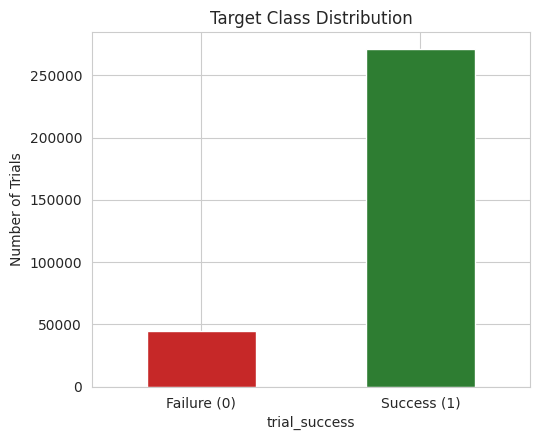
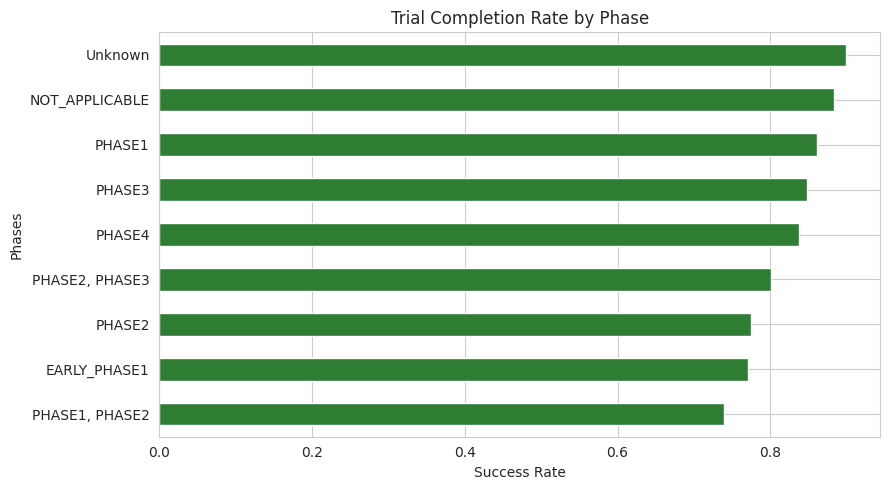
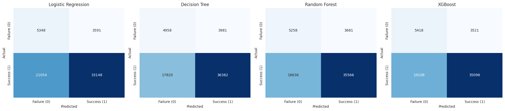
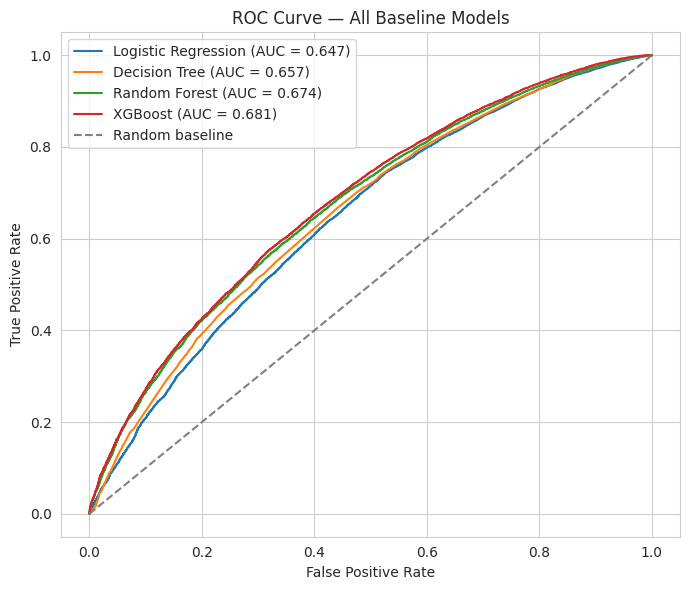
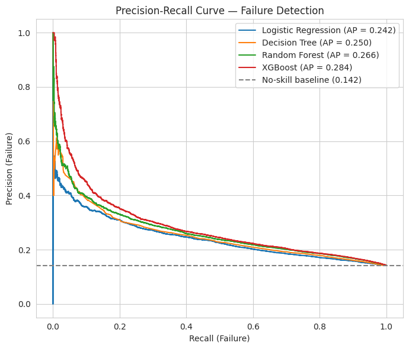
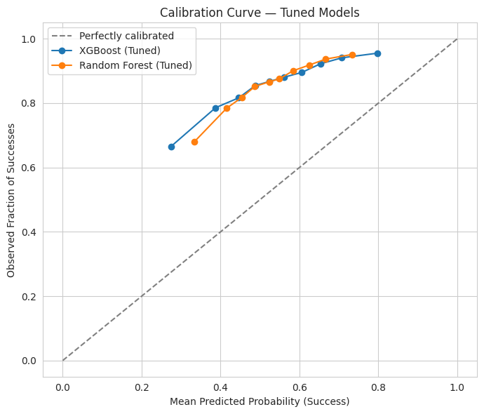
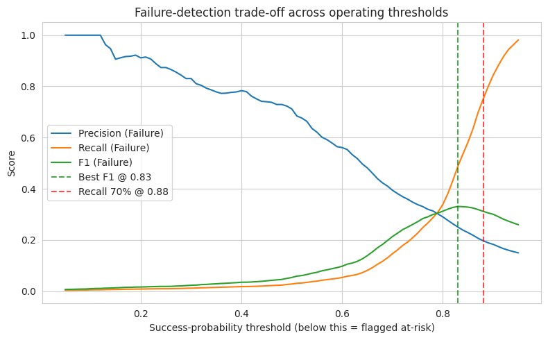
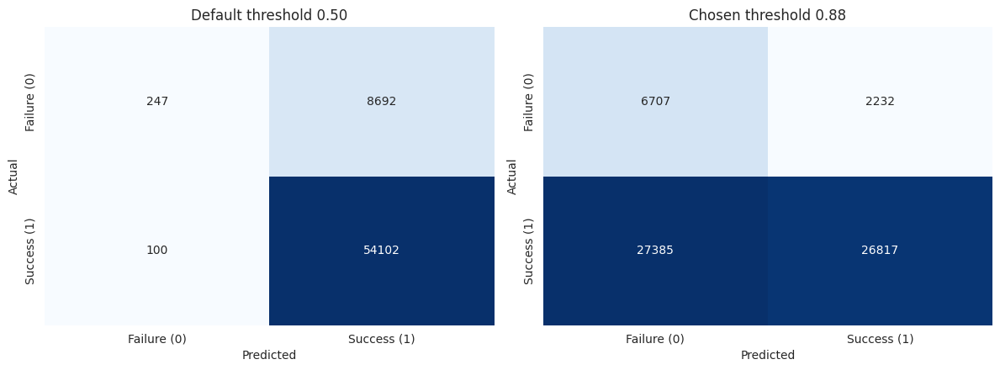
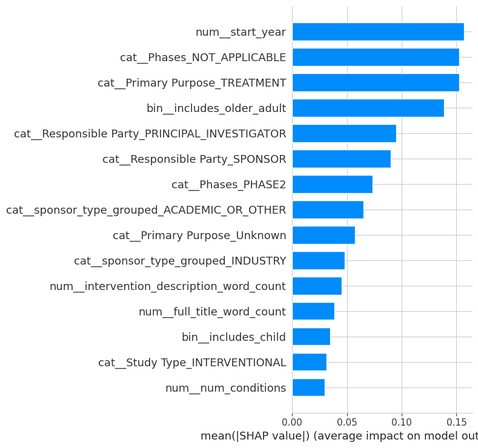

# Clinical Trial Success Prediction for Pharmaceutical Decision Support

A healthcare / pharmaceutical analytics machine learning project predicting whether a
clinical trial is likely to reach operational completion, using only information
available at or near the trial's design stage.

**🔗 Live app:** [clinicaltrialsuccessprediction-yrvyzr9jt7dsaefrhmubja.streamlit.app](https://clinicaltrialsuccessprediction-yrvyzr9jt7dsaefrhmubja.streamlit.app)

## Project Overview

This project builds an end-to-end classical ML pipeline — from raw ClinicalTrials.gov
data through cleaning, feature engineering, model tuning, imbalance handling,
calibration, explainability, and business recommendations — to support portfolio-risk
decisions in pharmaceutical R&D and CRO operations. It runs entirely on Google Colab
Free, using only classical ML (no deep learning, no heavy NLP).

## Business Motivation

Clinical trials are the largest cost driver in pharmaceutical R&D, and a substantial
share of registered trials terminate before completion — for funding, recruitment, or
strategic reasons. Every trial that fails after resources are already committed
represents sunk cost, delayed patient benefit, and portfolio risk. This project
explores whether design-time trial characteristics carry enough signal to flag at-risk
trials early enough for portfolio and operations teams to act on.

## Dataset

Source: [ClinicalTrials.gov Clinical Trials Dataset (Kaggle)](https://www.kaggle.com/datasets/danielansted/clinicaltrials-gov-clinical-trials-dataset)

315,701 trial records after cleaning, from an original 496,615-row export. The target
(`trial_success`) is an **operational** definition — `Completed` = success;
`Terminated` / `Withdrawn` / `Suspended` = failure; unresolved and Expanded Access
Program statuses are excluded. This is explicitly *not* a clinical efficacy label.

<p align="center">
  
</p>
<p align="center"><em>Target class balance — ~86% success / ~14% failure, the core imbalance this project is built around.</em></p>

## Methodology

1. **Dataset Inspection** — schema verified programmatically rather than assumed
2. **Data Cleaning & Target Engineering** — case-normalized status mapping, leakage
   audit, duplicate handling
3. **Feature Engineering** — 13 features built strictly from what the data supports
   (condition/intervention counts, eligibility flags, sponsor type, complexity index)
4. **Exploratory Data Analysis** — business-question-driven, hypothesis-testing EDA
5. **Model Building** — Logistic Regression, Decision Tree, Random Forest, XGBoost
   compared under one shared preprocessing pipeline
6. **Hyperparameter Tuning & Validation** — `RandomizedSearchCV`, calibration analysis,
   decision threshold analysis
7. **Imbalance Handling & Calibration** — cross-validated comparison of class weighting
   vs. SMOTE oversampling, isotonic probability recalibration, and an explicit,
   business-justified operating threshold selection
8. **Explainability** — SHAP global and local explanations, translated into business
   language and checked against domain hypotheses
9. **Business Insights** — a validated risk-tiering workflow and stakeholder-specific
   recommendations

## Exploratory Data Analysis

<p align="center">
  
</p>
<p align="center"><em>Completion rate by trial phase — one of six targeted business-question analyses in Phase 4.</em></p>

## Model Evaluation

<p align="center">
  
</p>
<p align="center"><em>Confusion matrices across all four baseline models.</em></p>

<p align="center">
  
</p>
<p align="center"><em>ROC curves comparing discriminative performance across models.</em></p>

<p align="center">
  
</p>
<p align="center"><em>Precision-recall curves framed around failure detection, the minority class.</em></p>

## Imbalance Handling & Calibration (Phase 5C)

<p align="center">
  
</p>
<p align="center"><em>Calibration curve before the Phase 5C fix — the uncalibrated model's Brier score (0.2179) was worse than a naive base-rate baseline (0.1215).</em></p>

<p align="center">
  
</p>
<p align="center"><em>Precision/recall/F1 trade-off swept across decision thresholds — the operating point (0.88) was chosen explicitly, not left at the default.</em></p>

<p align="center">
  
</p>
<p align="center"><em>Confusion matrix at the default threshold vs. the chosen operating threshold, side by side.</em></p>

## Key Results

Model selection was based on `PR-AUC (Failure=0)` and calibration quality — not raw
accuracy — since accuracy is dominated by the ~86% majority (success) class. Final
test-set performance (XGBoost, tuned, isotonic-calibrated):

| Metric | Score |
|---|---|
| PR-AUC (Failure) | 0.2874 |
| ROC-AUC | 0.6838 |
| Brier score | 0.1136 |
| MCC | 0.1714 |
| Balanced Accuracy | 0.6225 |

**Imbalance handling:** class weighting (`scale_pos_weight`) was cross-validated
against SMOTE oversampling. Class weighting was confirmed as the stronger approach —
SMOTE reduced PR-AUC (Failure) from 0.2796 to 0.2580 despite raising raw recall.

**Calibration:** isotonic recalibration fixed the Brier score from 0.2179 (worse than
the 0.1215 naive baseline) to 0.1136, while leaving PR-AUC essentially unchanged.

**Operating threshold:** selected explicitly at 0.88 to prioritize catching at-risk
trials (75.0% recall on the failure class), with the stated cost that 54.0% of the
portfolio is flagged for review. A more balanced alternative (threshold 0.83, 48.8%
recall, 27.6% flagged) is also available depending on review capacity.

## Explainability (SHAP)

<p align="center">
  
</p>
<p align="center"><em>Global SHAP summary — feature impact direction and magnitude.</em></p>

<p align="center">
  
</p>
<p align="center"><em>Ranked feature importance by mean absolute SHAP value.</em></p>

Findings were explicitly checked against earlier EDA hypotheses, with any
contradictions documented rather than smoothed over.

## Business Recommendations

A three-tier risk workflow (High / Medium / Low, based on predicted success
probability) is proposed for portfolio review prioritization, validated against actual
held-out completion rates. This analysis does *not* claim causality, clinical
efficacy, or measured financial ROI.

## Live Streamlit App

The saved, calibrated pipeline is wrapped in a single-page Streamlit app so anyone can
score a hypothetical trial without opening the notebook.

**🔗 [Try it live](https://clinicaltrialsuccessprediction-yrvyzr9jt7dsaefrhmubja.streamlit.app)**

## Technologies Used

Python, Pandas, NumPy, Scikit-learn, XGBoost, SHAP, imbalanced-learn, Matplotlib,
Seaborn, Streamlit — all run on Google Colab Free (CPU only, no paid GPU required).

## Installation

```bash
pip install -r requirements.txt
```

## How to Run

**Notebook:**
1. Open `notebooks/Clinical_Trial_Success_Prediction.ipynb` in Google Colab
2. Upload the dataset to Google Drive as described in Phase 1
3. Run all cells top to bottom

**Streamlit app (local):**
```bash
streamlit run app.py
```

## Repository Structure

```
clinical-trial-success-prediction/
├── data/                    # not committed (see .gitignore)
├── notebooks/
│   └── Clinical_Trial_Success_Prediction.ipynb
├── screenshots/
│   └── (README figures — EDA, model evaluation, calibration, threshold, SHAP)
├── models/
│   └── final_model.pkl      # calibrated pipeline (preprocessing + tuned classifier + isotonic calibration)
├── app.py
├── requirements.txt
└── README.md
```

## Future Improvements

- Modularize notebook logic into a reusable `src/` package
- Re-run against a richer ClinicalTrials.gov export including enrollment, location,
  and completion-date fields to build the duration/enrollment/site-count features
  originally scoped but unavailable in this export
- Periodic re-validation of feature importance and risk-tier boundaries as new trial
  data accumulates

## Author

Rajveer Singh
